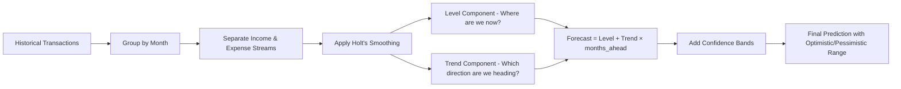
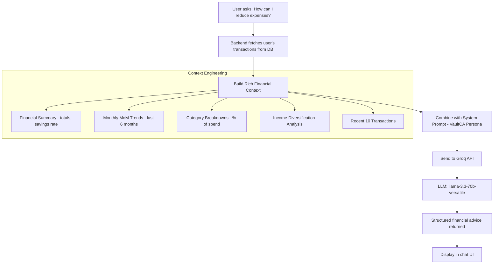
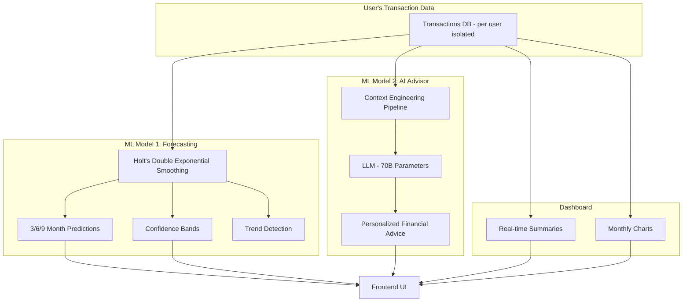

# SmartFlow AI — ML Models Explained

SmartFlow AI uses **two ML/AI models** working together to give Indian SMBs intelligent financial insights.

---

## Model 1: Cash Flow Forecasting — Holt's Double Exponential Smoothing

### What it does
Predicts future **income, expenses, and net cash flow** for the next 3/6/9 months based on transaction history.

### Why not simple Linear Regression?
A straight line (`y = mx + b`) is too simplistic — it can't capture **accelerating or decelerating trends**. If your business income grew slowly for 3 months then started growing fast, linear regression averages it out and gives a mediocre prediction.

### How Holt's Method Works

Holt's method tracks **two components** simultaneously:

```
Level (Lₜ)  = α × actual_data + (1 - α) × (previous_level + previous_trend)
Trend (Tₜ)  = β × (current_level - previous_level) + (1 - β) × previous_trend
```



#### The Two Parameters
| Parameter | Value | Role |
|-----------|-------|------|
| **α (alpha) = 0.3** | Level smoothing | How much weight to give **recent data** vs history. 0.3 means 30% recent, 70% historical — balances reactivity with stability |
| **β (beta) = 0.1** | Trend smoothing | How quickly the trend adapts. 0.1 means the trend changes slowly — prevents wild swings from one unusual month |

#### Step-by-step Example
Say monthly income was: ₹3000, ₹3200, ₹3500, ₹4000

1. **Initialize**: Level = ₹3000, Trend = ₹200 (difference between first two)
2. **Month 2**: Level = 0.3 × 3200 + 0.7 × (3000+200) = **₹3200**
3. **Month 3**: Updates level and trend again, capturing the acceleration
4. **Month 4**: Now the model knows income is growing ~₹300-400/month
5. **Forecast Month 5**: Level + Trend × 1 = **~₹4350** (not just a flat average)

### Confidence Bands
We calculate the **standard deviation** of historical data and use it to create prediction ranges:

```
Upper bound (Optimistic)  = Prediction + StdDev × (1 + 0.3 × months_ahead)
Lower bound (Pessimistic) = Prediction - StdDev × (1 + 0.3 × months_ahead)
```

> [!IMPORTANT]
> The bands **widen for further-out predictions** — because uncertainty naturally increases the further you forecast. This is statistically honest.

### Confidence Score
Calculated using the **Coefficient of Variation (CV)**:

```
CV = Standard Deviation / |Mean Net Cash Flow|
Confidence = (1 - CV) × 100%
```

- **High confidence (70%+)**: Cash flow is consistent and predictable
- **Medium (40-70%)**: Some variability in cash flow
- **Low (<40%)**: Highly variable — predictions are less reliable

### Why this is better than basic approaches

| Approach | Captures Trend? | Adapts to Change? | Confidence? |
|----------|:-:|:-:|:-:|
| Simple Average | ❌ | ❌ | ❌ |
| Linear Regression | ✅ (straight line only) | ❌ | ❌ |
| **Holt's Smoothing** ✅ | **✅ (curved trends)** | **✅ (via α, β)** | **✅ (bands + score)** |

---

## Model 2: AI Financial Advisor — LLM (Large Language Model)

### What it does
Users ask financial questions in **natural language**, and the AI gives **personalized, data-backed advice** specific to their business.

### Architecture



### The Model
- **Model**: `llama-3.3-70b-versatile` (Meta's LLaMA 3.3, 70 billion parameters)
- **Hosted on**: Groq (ultra-fast inference with custom LPU chips)
- **Why 70B?**: The 8B model gave generic advice. The 70B model can **reason about numbers**, calculate percentages, and spot patterns

### Context Engineering (The Key Innovation)

The quality of LLM output depends heavily on **what context you provide**. We send 5 layers of financial data:

#### Layer 1: Financial Summary
```
Total Income: ₹57,250.00
Total Expenses: ₹10,693.00
Net Cash Flow: ₹46,557.00
Savings Rate: 81.3%
```

#### Layer 2: Monthly Trends with Month-over-Month Growth
```
2024-04 → Income: ₹4000, Expense: ₹1665, Net: ₹2335
2024-05 → Income: ₹4250, Expense: ₹1853, Net: ₹2397 (MoM: +2.7%)
2024-06 → Income: ₹4250, Expense: ₹1822, Net: ₹2428 (MoM: +1.3%)
```

#### Layer 3: Expense Categories with Percentages
```
Rent: ₹7200 (67.3% of expenses)
Food: ₹2180 (20.4%)
Transport: ₹425 (4.0%)
```

#### Layer 4: Income Source Diversification
```
Salary: ₹21000 (36.7%)
Sales: ₹25000 (43.7%)
Freelance: ₹1250 (2.2%)
```

#### Layer 5: Recent Transaction History
The last 10 transactions for temporal context.

### System Prompt — VaultCA Persona
The LLM is given a specialized persona:
- Expert in **Indian SMB finance** (GST, Income Tax context)
- References **specific numbers** from the user's data
- Flags **risk signals** automatically:
  - Savings rate < 20% → concern
  - Single income source > 70% → diversification risk
- Uses **₹ (INR)** for all amounts
- Temperature set to **0.4** (less creative, more analytical)

### Example Output

**User**: "How can I reduce my expenses?"

**AI Response**:
> "Focus on optimizing your rent category, which accounts for **67.3% of your total expenses (₹7,200)**. Consider negotiating a lower rent or exploring alternative accommodation options. Additionally, review your food expenses **(₹2,180, 20.4% of expenses)** and look for ways to reduce dining out. Given your high savings rate of **81.3%**, you may also want to allocate a portion towards an emergency fund. Notably, your income is relatively diversified, with no single source exceeding 50%, which is a positive sign."

> [!TIP]
> Notice how every sentence references **actual data** — this is only possible because of the rich context engineering, not the model alone.

---

## How Both Models Work Together



## Technical Summary for Judges

| Aspect | Forecast Model | AI Advisor |
|--------|---------------|------------|
| **Algorithm** | Holt's Double Exponential Smoothing | LLM (llama-3.3-70b-versatile) |
| **Type** | Statistical time-series forecasting | Generative AI / NLP |
| **Input** | Monthly aggregated income & expense | Full financial profile (5 context layers) |
| **Output** | Predicted values + confidence bands | Natural language financial advice |
| **Key innovation** | Captures accelerating/decelerating trends | Rich context engineering with risk flags |
| **Infra** | Runs on backend (pure Java, no ML library needed) | Groq Cloud (sub-second inference) |
| **Per-user** | ✅ Each user gets their own forecast | ✅ Each user gets personalized advice |

> [!NOTE]
> Both models are **per-user isolated** — each user's transactions are stored with their `userId`, ensuring no data leakage between accounts. A new user starts with a blank slate.
